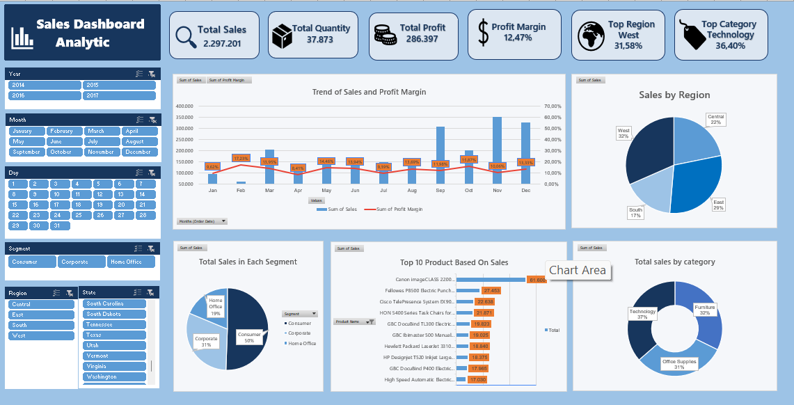

# Sales Analytics Dashboard Using Excel

An interactive **sales analytics dashboard developed in Microsoft Excel** to explore sales performance, profitability, customer segments, products, and regional trends through a dynamic and user-friendly interface.

## 🔎 About the Project

This project focuses on turning raw transaction data into a visual analytical dashboard that makes sales performance easier to understand.

Instead of relying on static tables, the dashboard allows users to interact with the data through multiple slicers and instantly see how the selected criteria affect key performance indicators and visualizations.

The analysis covers **sales, quantity, profit, profit margin, products, categories, customer segments, regions, states, and time-based trends**.

## 📊 What Does the Dashboard Show?

The dashboard summarizes several aspects of sales performance:

* **Total Sales** — overall revenue generated
* **Total Quantity** — total units sold
* **Total Profit** — overall profit generated
* **Profit Margin** — profitability relative to sales
* **Regional Performance** — sales contribution by region
* **Category Performance** — comparison across product categories
* **Product Performance** — identification of higher-performing products
* **Sales Trends** — changes in sales and profit margin over time

## 🎛️ Explore the Data

One of the main focuses of this dashboard is interactivity.

Users can filter the analysis using:

* **Year**
* **Month**
* **Day**
* **Segment**
* **Region**
* **State**

Multiple filters can be applied simultaneously. For example, users can select a specific **year + customer segment + region** to investigate a particular portion of the sales data.

The KPI cards and dashboard visualizations respond to the selected filters, making it possible to explore the dataset without manually changing the underlying calculations.

## 📁 Dataset Structure

The dataset consists of transaction-level sales records containing the following fields:

| Category                 | Fields                                           |
| ------------------------ | ------------------------------------------------ |
| **Order Information**    | Order ID, Order Date, Ship Date, Ship Mode       |
| **Customer Information** | Customer ID, Customer Name, Segment              |
| **Location**             | Country, City, State, Postal Code, Region        |
| **Product Information**  | Product ID, Category, Sub-Category, Product Name |
| **Sales Metrics**        | Sales, Quantity, Discount, Profit                |
| **Time Attributes**      | Calendar, Month, Year                            |

## 🧮 Key Performance Indicators

The dashboard currently shows:

| Metric               |        Result |
| -------------------- | ------------: |
| Total Sales          | **2,297,201** |
| Total Quantity       |    **37,873** |
| Total Profit         |   **286,397** |
| Profit Margin        |    **12.47%** |
| Highest Sales Region |      **West** |

These values are connected to the dashboard filtering system and change according to the selected analysis criteria.

## 🛠️ Built With

**Microsoft Excel**

Techniques and features used in this project include:

* PivotTables
* PivotCharts
* Slicers
* Excel formulas
* GETPIVOTDATA
* Dynamic KPI references
* Data aggregation
* Interactive filtering
* Dashboard layout and visualization

## 📈 Analysis Areas

### Time-Based Analysis

Sales performance can be explored across different years, months, and days to identify changes in sales and profitability over time.

### Regional Analysis

The dashboard provides a comparison of sales performance across:

* Central
* East
* South
* West

State-level filtering provides a more detailed view of regional performance.

### Customer Segment Analysis

Sales can be compared across the three customer segments:

* Consumer
* Corporate
* Home Office

### Product & Category Analysis

The dashboard can be used to investigate differences in performance between categories, sub-categories, and individual products.

## 💡 Highlights from the Analysis

Based on the current dataset:

* The analyzed transactions generate **2.29M in total sales**.
* **37,873 units** are recorded across the dataset.
* Total profit reaches **286K**, resulting in a **12.47% profit margin**.
* The **West region** has the highest sales contribution among the regions analyzed.
* Sales performance differs across customer segments, regions, states, and product categories.
* The interactive filters make it easier to investigate these differences from multiple perspectives.

> **Note:** These observations represent patterns found in the dataset and do not imply causal relationships.

## 🖼️ Dashboard Preview

## 📌 Why I Built This Project

This project was created as a practical exercise in **Excel-based data analysis and dashboard development**.

The goal was not only to create charts, but to build a dashboard where raw transaction data can be explored interactively and translated into information that is easier for business users to understand.

It demonstrates the process of working with structured sales data, summarizing it through PivotTables, creating visualizations, and connecting those components into an interactive dashboard.

## 📚 Key Takeaways

Through this project, I practiced:

* Structuring and analyzing transaction data
* Building dynamic PivotTable-based analysis
* Designing interactive dashboards in Excel
* Creating KPI cards linked to analytical results
* Using slicers for multidimensional analysis
* Presenting business information through data visualization

## 👩‍💻 Skills

`Excel` `Data Analysis` `Sales Analytics` `PivotTables` `PivotCharts` `Data Visualization` `Dashboard Development` `Business Analytics`

---

**Created as part of my data analytics portfolio.**
